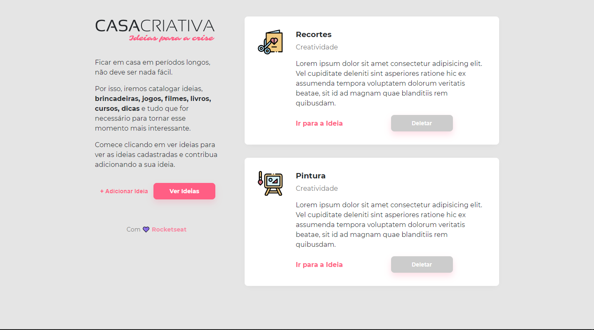
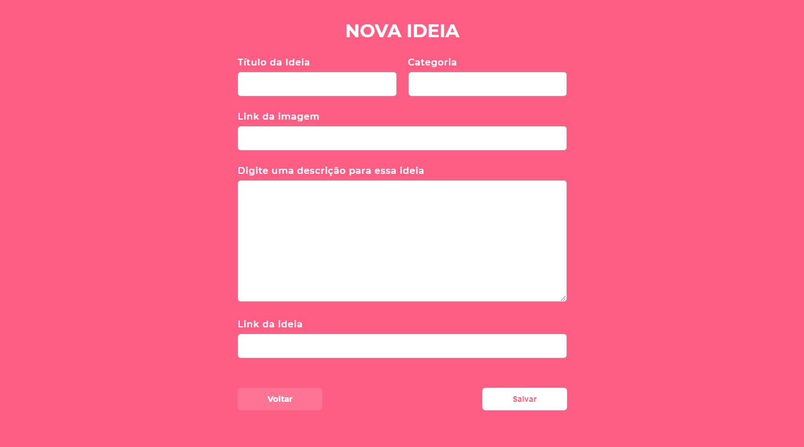
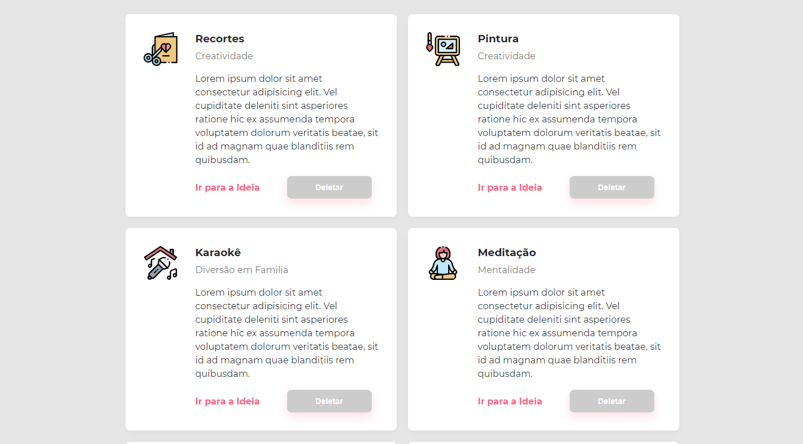

<h1 align="center">
    
</h1>

  Um site onde você pode guardar suas ideais.

📌 Sobre o Casa Criativa
------------------
Seu desenvolvimento ocorreu durante a semana OmniStack 11. O site surgiu com o objetivo de ajudar pessoas a poderem ter onde guardar suas ideias de uma maneira simples. 

🚀 Tecnologias:
------------------
- CSS 
- HTML
- JavaScript
- Node.js
- SQL

💻 Começando:
------------------
1. Clone este repositório usando: `https://github.com/grioos/workshopdev-casacriativa.git`
2. Vá para o diretório apropriado: `cd workshopdev-casacriativa`
3. Para instalar todas as dependências, no terminal digite: `npm install`
4. Digite no terminal  `npm run dev` para iniciar o projeto
5. No navegador, digite `http://localhost:3333`

------------------
Feito com :black_heart: by [Gabriel Rios](https://www.linkedin.com/in/grioos/)
